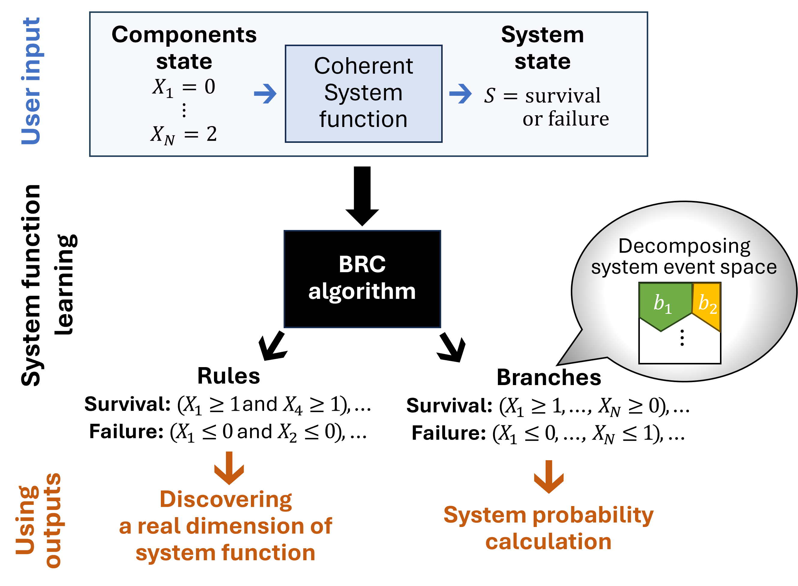
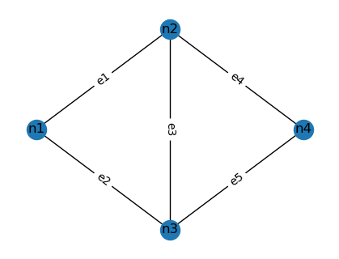
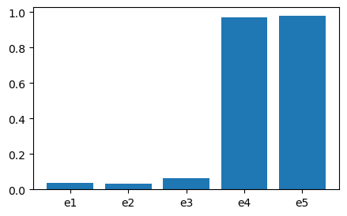

==========================================
Getting Started with the BRC Algorithm
==========================================

.. note::
   The **Branch and Bound Algorithm for Reliability of Coherent Systems** (**BRC**) is an efficient method for analysing **system reliability with discrete-state component events and a binary-state system event.** It identifies (sub-)minimal survival and failure rules while computing system failure probability using a branch-and-bound approach. Official publication is available at `arXiv <https://arxiv.org/abs/2410.22363>`_.

Introduction
============

The BRC algorithm identifies (sub-)minimal survival and failure rules and computes the system failure probability using a branch-and-bound approach. 

BRC applies to **any general coherent system**, meaning systems where an improvement in component states never leads to a worse system state.

The figure below illustrates the BRC process (or more details, refer to the official publication on `arXiv <https://arxiv.org/abs/2410.22363>`_):

   **Illustration of the BRC algorithm.** 

Code Demonstration
==================

The Jupyter notebook for this tutorial is available on `GitHub <https://github.com/jieunbyun/MBNpy/blob/main/notebooks/tutorial_brc.ipynb>`_.

MBNPy Version
-------------
This tutorial uses **MBNPy v0.1.2**.

Installation
============

Ensure you have the required dependencies installed before running the tutorial:

.. code-block:: python

   import networkx as nx
   import matplotlib.pyplot as plt
   from mbnpy import cpm, variable, inference
   from networkx.algorithms.flow import shortest_augmenting_path
   from mbnpy import brc
   import numpy as np

Example: Five-Edge Network
==========================

Network Topology
----------------
We analyse the **five-edge network** below:

.. code-block:: python

   nodes = {'n1': (0, 0),
            'n2': (1, 1),
            'n3': (1, -1),
            'n4': (2, 0)}

   edges = {'e1': ['n1', 'n2'],
            'e2': ['n1', 'n3'],
            'e3': ['n2', 'n3'],
            'e4': ['n2', 'n4'],
            'e5': ['n3', 'n4']}

   # Plot network
   plt.figure(figsize=(4,3))
   G = nx.Graph()
   for node in nodes:
       G.add_node(node, pos=nodes[node])
   for e, pair in edges.items():
       G.add_edge(*pair, label=e)

   pos = nx.get_node_attributes(G, 'pos')
   edge_labels=nx.get_edge_attributes(G, 'label')
   nx.draw(G, pos, with_labels=True)
   nx.draw_networkx_edge_labels(G, pos, edge_labels=edge_labels)
   plt.show()

   **Network topology with five edges.**

Defining Component Events
-------------------------
The **state of each edge** is represented by a binary variable:

.. code-block:: python

   varis = {}
   for k, v in edges.items():
       varis[k] = variable.Variable(name=k, values=[0, 1])  # 0 = non-functional, 1 = functional

   print(varis['e1'])

The probabilities of each component event:

.. code-block:: python

   probs = {'e1': {0: 0.01, 1: 0.99},
            'e2': {0: 0.01, 1: 0.99},
            'e3': {0: 0.05, 1: 0.95},
            'e4': {0: 0.05, 1: 0.95},
            'e5': {0: 0.10, 1: 0.90}}

Defining the System Event
-------------------------
The system's state is determined by **connectivity** between an **origin-destination (OD) pair**.

A system function must:
- Take a **dictionary of component states** as input.
- Return:
  1. **System value** (informational).
  2. **System state** (`'s'` for survival, `'f'` for failure).
  3. **Minimum component state** that guarantees the system state.

The function is implemented as follows:

.. code-block:: python

   def net_conn(comps_st, od_pair, edges, varis):

       # Build a graph with edge capacities based on component states
       G = nx.Graph()
       for k, st in comps_st.items():
           edge_k = edges[k]
           origin_k, dest_k = edge_k[0], edge_k[1]

           G.add_edge(origin_k, dest_k)

           # Set capacity 
           capa_k = varis[k].values[st]  # 1 for functional, 0 for non-functional
           G[origin_k][dest_k]['capacity'] = capa_k 

       # To check whether od_pair is connected, as well as the path between them, we add a new edge from destination to a new dummy node with capacity 1 and check if the maximum flow is greater than 0.
       G.add_edge(od_pair[1], 'new_d', capacity=1) # add a dummy edge
       f_val, f_dict = nx.maximum_flow(G, od_pair[0], 'new_d') # compute maximum flow from origin to dummy node

       # Determine the system state and the minimum component state that guarantees the system state
       if f_val > 0: # system survival
           sys_st = 's'
           min_comp_st = {k: 1 for k, x in f_dict.items() if x > 0}  # components with flow > 0 need to be functional for system survival
       else: # system failure
            sys_st = 'f'
            min_comp_st = None  # since it is more complex to determine the minimum component state for system failure, we return None for simplicity

       return f_val, sys_st, min_comp_st # f_val is returned only for informational purposes, and is not used by BRC.

The OD pair is set to `('n1', 'n4')`:

.. code-block:: python

   od_pair = ('n1', 'n4')

Running the BRC Algorithm
=========================

Now, we run the BRC algorithm. By setting the target unknown probability as zero, i.e. `pf_bnd_wr=0.0`, the analysis terminates after identifying all survival and failure rules:

.. code-block:: python

   brs, rules, sys_res, monitor = brc.run(probs, sys_fun, max_sf=np.inf, max_nb=np.inf, pf_bnd_wr=0.0)

When there are many rules, the algorithm can be set to terminate early by setting a positive value for `pf_bnd_wr`, which is the bound on the probability ratio of unknown branches to failure branches. For example, setting `pf_bnd_wr=0.1` terminates the analysis when the probability of unknown probability is less than 10% of that of failure probability.

One can also set a maximum number of rules to generate by setting `max_rules`. For example, setting `max_rules=200` terminates the analysis when 200 rules are generated, regardless of the probability bounds. Emprically, we find BRC struggles to handle more than 200-300 rules, so setting `max_rules` can be useful for large systems. 

BRC output
---------------------------

.. code-block:: text

   *** Analysis completed with 8 system function runs ***
   System failure probability: 5.16e-3
   Found non-dominated rules (failure: 4, survival: 4)

Extracting System Rules
-----------------------

We can check what rules BRC identified:

.. code-block:: python

   print(rules['s'])  # Survival rules
   print(rules['f'])  # Failure rules

This returns:

.. code-block:: text

   Survival Rules: [{'e1': 1, 'e4': 1}, {'e2': 1, 'e5': 1}, {'e2': 1, 'e3': 1, 'e4': 1}, {'e1': 1, 'e3': 1, 'e5': 1}]
   Failure Rules: [{'e4': 0, 'e5': 0}, {'e1': 0, 'e2': 0}, {'e1': 0, 'e3': 0, 'e5': 0}, {'e2': 0, 'e3': 0, 'e4': 0}]

It finds four survival and four failure rules. For example, the first survival rule `{'e1': 1, 'e4': 1}` indicates that if edges `e1` and `e4` are functional, then the system survives regardless of the states of other edges.

Setting Up Probability Distributions
=====================================

BRC branches can be used to construct **Conditional Probability Matrices (CPMs)** for further probabilistic analysis.

First, we define the system variable and build CPMs for both component and system events:

.. code-block:: python

   varis['sys'] = variable.Variable(name='sys', values=['f', 's']) # state 0 for failure and 1 for survival

   # probability distributions using CPM
   cpms = {}

   # component events
   for k, v in edges.items():
       cpms[k] = cpm.Cpm( variables = [varis[k]], no_child=1, C = np.array([[0],[1]]), p=np.array([probs[k][0], probs[k][1]]) )

   # system event
   Csys = branch.get_cmat(branches = brs, comp_varis={'e1': varis['e1'], 'e2': varis['e2'], 'e3': varis['e3'], 'e4': varis['e4'], 'e5': varis['e5']})
   print("C matrix of P(sys | e1, e2, e3, e4, e5):")
   print(Csys) # each branch becomes a row in the system's event matrix
   psys = np.array([1.0]*len(Csys)) # the system function is determinisitic, i.e. all instances have a probability of 1.

   # Define CPM of P(sys | e1, e2, e3, e4, e5)
   cpms['sys'] = cpm.Cpm( [varis['sys']] + ['e1', 'e2', 'e3', 'e4', 'e5'], 1, Csys, psys )
   print(cpms['sys'])

Each branch becomes a row in the system event matrix. Since the system function is deterministic, all probabilities are set to 1:

.. code-block:: text

   C matrix of P(sys | e1, e2, e3, e4, e5):
   [[1 1 2 2 1 2]
    [1 1 1 2 0 1]
    [1 0 1 1 1 2]
    [0 1 2 2 0 0]
    [0 0 1 1 0 0]
    [1 0 1 1 0 1]
    [0 1 0 0 0 1]
    [1 1 0 1 0 1]
    [1 0 1 0 2 1]
    [0 0 0 2 2 2]
    [0 0 1 0 2 0]]

   <CPM representing P(sys | e1, e2, e3, e4, e5)>
   +-------+------+------+------+------+------+-----+
   |   sys [   e1 |   e2 |   e3 |   e4 |   e5 ]   p |
   +=======+======+======+======+======+======+=====+
   |     1 [    1 |    2 |    2 |    1 |    2 ]   1 |
   +-------+------+------+------+------+------+-----+
   |     1 [    1 |    1 |    2 |    0 |    1 ]   1 |
   +-------+------+------+------+------+------+-----+
   |     1 [    0 |    1 |    1 |    1 |    2 ]   1 |
   +-------+------+------+------+------+------+-----+
   |     0 [    1 |    2 |    2 |    0 |    0 ]   1 |
   +-------+------+------+------+------+------+-----+
   |   :   [  :   |  :   |  :   |  :   |  :   ]  :  |
   +-------+------+------+------+------+------+-----+
   |     1 [    0 |    1 |    0 |    2 |    1 ]   1 |
   +-------+------+------+------+------+------+-----+
   |     0 [    0 |    0 |    2 |    2 |    2 ]   1 |
   +-------+------+------+------+------+------+-----+
   |     0 [    0 |    1 |    0 |    2 |    0 ]   1 |
   +-------+------+------+------+------+------+-----+

Computing System Probability
-----------------------------

From the CPMs, the system failure probability :math:`P(S=0)` can be obtained by **variable elimination** (cf. `MBNpy tutorial <https://jieunbyun.github.io/MBNpy-docs/getting_started_MBN>`_):

.. code-block:: python

   var_elim_order = ['e1', 'e2', 'e3', 'e4', 'e5']

   cpm_s = inference.variable_elim(cpms = cpms, var_elim = var_elim_order)
   print(cpm_s)

This returns:

.. code-block:: text

   <CPM representing P(sys | )>
   +-------+------------+
   |   sys [ ]          p |
   +=======+============+
   |     1 [ ] 0.994831 |
   +-------+------------+
   |     0 [ ] 0.005169 |
   +-------+------------+

The system failure probability is :math:`P(S=0) = 5.17 \times 10^{-3}`, consistent with the BRC result.

Computing Component Importance Measure
==============================

In addition, CPMs can be used to calculate any joint or conditional probability. For instance, `Conditional probability-based importance measure (CPIM) <https://doi.org/10.1016/j.ress.2008.02.011>`_ is calculated as:

.. math::

   P(X_n=0 | S=0) = \frac{P(X_n=0, S=0)}{P(S=0)}

.. code-block:: python

   def get_cim(comp_name, cpms, varis, pf):
       # Variable elimination order: Eliminate all component variables except for the component of interest and the system variable
       var_elim_names = [varis[e] for e in edges if e != comp_name]

       # Compute P(X_n, S)
       cpm_s_x = inference.variable_elim(cpms, var_elim_names)

       # Get probability P(X_n=0, S=0) from the resulting CPM
       p_s0_x0 = cpm_s_x.get_prob(var_inds = [comp_name, 'sys'], var_states = [0, 0])

       # CPIM = P(X_n=0 | S=0) = P(X_n=0, S=0) / P(S=0)
       cpim = p_s0_x0 / pf
       return float(cpim)

   cims = {comp: get_cim(comp, cpms, varis, 5.17e-3) for comp in edges}
   print(cims)

Results:
{'e1': 0.036, 'e2': 0.031, 'e3': 0.059, 'e4': 0.928, 'e5': 0.934}

Component importance visualisation:

----------------------
Summary
----------------------
- The **BRC algorithm** calculates **system failure probability** for **general coherent systems**.
- It identifies **(sub-)minimal survival and failure rules**.
- Identified rules are used to decompose system event space into **failure and survival branches**.
- **Branches** can be used to compute advanced probability queries such as **component importance measures**.

