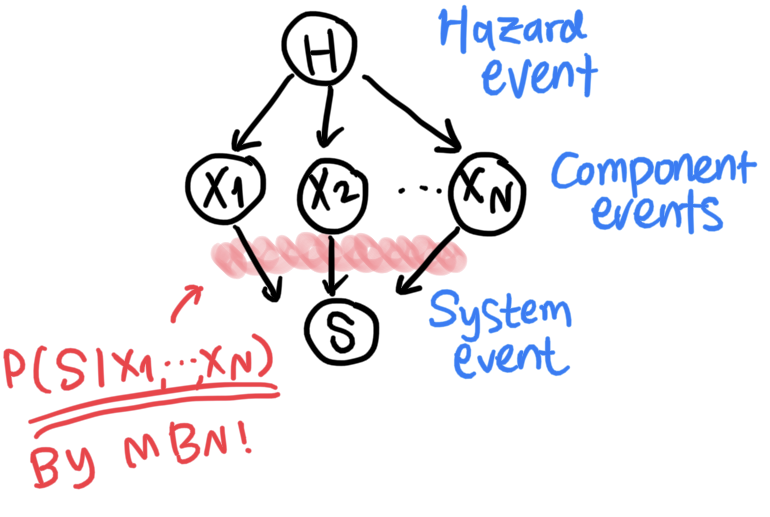

===============================
MBNpy
===============================

**MBNpy** is a Python toolkit for matrix-based Bayesian network (MBN).
MBN enables applying Bayesian network for **large-scale systems** (i.e. high-dimensional system events) by providing an alternative **matrix-based representation of probability distributions**.

Bayesian network is a probabilistic graphical model that can map the causality between variables, for example:

   An illustration of a Bayesian network.

For further reading:

* For a brief introduction of Bayesian network in the context of system reliability, refer to `this blog article <https://jieunbyun.github.io/categories/bn/>`_.
* For a brief introduction of the motivation and concept of matrix-based Bayesian network, refer to `What's MBN? <https://jieunbyun.github.io/bn/2024/01/22/1_whats_mbn.html>`_.
* For a formal publication, refer to Byun, J. E. & Song, J. (2021). Generalized matrix-based Bayesian network for multi-state systems. *Reliability Engineering & System Safety*, 211, 107468. `doi: 10.1016/j.ress.2021.107468 <https://doi.org/10.1016/j.ress.2021.107468>`_.

.. toctree::
   :maxdepth: 1
   :caption: Getting Started

   getting_started_MBN
   getting_started_BRC
   composite_states

.. toctree::
   :maxdepth: 1
   :caption: API reference

   variable
   cpm
   inference
   brc
   branch

